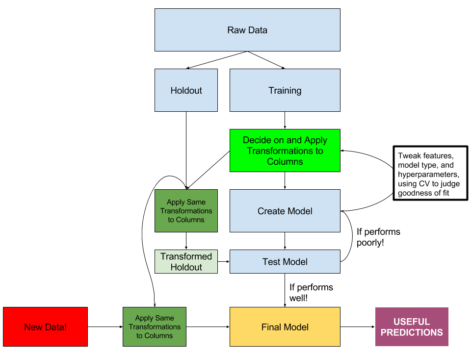

# Preprocessing in sklearn

By the end of this lesson you will know:
1. How the `.fit()` and `.transform()` methods differ for the preprocessing library
2. Why using sklearn preprocessing libraries can be useful
3. The following preprocessing modules:
    - Binarizer
    - Imputer
    - PolynomialFeatures
    - Scalers (StandardScaler, MinMaxScaler, RobustScaler)
4. How to use the preprocessing library with train-test split

Sklearn provides a number of libraries that preprocess your data. We've used some of them in the past as well.

## Intro to Preprocessing libraries

For modeling techniques in sklearn, those modules come standard with the following methods:

- `fit()`
- `predict()`
- `score()`

Within the preprocessing libraries, we see another set of standard methods:

- `fit()`
- `transform()`

What's happening here?

`fit()` will plan out the steps necessary for transformation but not apply it. For example, if we use `StandardScaler()` on a column, _inside_ of our instantiated object, the following instructions are written:

1. Here is the mean I will apply: *x*
2. Here is the standard deviation I will apply: *y*
3. When transform is called, take each value, subtract the mean I have stored, divide it by the standard deviation I have stored, return those transformed values

In other words, it lets us apply the same standards across multiple sets of data!

`transform()` just carries out the steps that have been stored during fitting. 

## Why use preprocessing libraries?

The main reason to use the sklearn preprocessing libraries is to ensure **consistent and reproducible transformation of our data across different datasets**

Outside of the data that we train a model with, our model will see at least two other datasets (if it is being used in production):

- Our holdout test set before we deploy or have finished our model
- **New** data that we do not know the "true" value of that we are trying to predict.

In other words, we're embarking on this process:



What is key in this process is that the **same** transformations are happening to **different** sets of data. How do we make sure that the same transformations are happening to the training data, the holdout test data, **and** new data that comes through to the finished product.

## This seems like a lot to do at once!

It is a lot to do at once and therefore you shouldn't be setting this up right away. What to keep in mind is:

1. What transformations can be reproduced reliably for all three stages of the transformations
2. This is a great place to think through the larger scale data science process.

As you are in that early model generation process, don't worry about setting up reproducible transformation portion at the start. As your model tightens up and approaches a final state, that is a place to begin thinking about reproducible transformations. 

## Different libraries in sklearn

We'll talk through some of the different libraries below with some sample code. The documentation and other details can be found in the sklearn API reference [here](http://scikit-learn.org/stable/modules/classes.html#module-sklearn.preprocessing). 

## Why sklearn libraries in particular

What you'll notice about the following libraries is that they all keep some sort of memory that can be replicated later on. They might be one of the following:

1. A set of columns to create (such as making a specific set of columns)
2. Some sort of value to remember to transform a column (such as a mean and standard deviation, etc.)

We will need those same values as we keep transforming new data (and, most importantly, _we don't want to derive these values from the new data_!) These sklearn classes are helpful because they handle that memorization for us. 

## Major sklearn preprocessing libraries 

### Binarizer -- Creating a Cutoff Value

Binarizer takes a threshold and will code your data 1 if the threshold is above that threshold and 0 if the data is below that threshold.

```python

from sklearn.preprocessing import Binarizer

bin = Binarizer(20)
bin.fit(data)
bin.transform(data)
```

### Imputer -- Filling in Missing Values

This processor gives you an implementation of `.fillna()` in Pandas, but within sklearn. Your choices for imputation are the average value, median value, or most frequent value. There are options to fill in missings with a specific value of your choosing, but that is in a more advanced preprocessing library known as [`FunctionTransformer`](http://scikit-learn.org/stable/modules/generated/sklearn.preprocessing.FunctionTransformer.html#sklearn.preprocessing.FunctionTransformer) that we are not able to cover at this point.

```python

from sklearn.preprocessing import Imputer

impute = Imputer(strategy='median')
impute.fit(data)
impute.transform(data)
```

### PolynomialFeatures -- Automatically Create Polynomial Features

This preprocessor creates polynomial (and optionally, interaction terms) from your input. By default it will also put a _bias_ term (your term to the power of 0, which is 1) as well. This example shows a case without it.

```python
import numpy as np
from sklearn.preprocessing import PolynomialFeatures

pf = PolynomialFeatures(3, include_bias=False)
pf.fit(data)
pf.transform(data)
```

### Scalers -- Standardize, Normalize, or Otherwise Scale Data

The following sklearn scalers all rescale data according to certain methods, but are used the same way in each case:

- `MinMaxScaler` - scales the data using the max and min values so that it fits between 0 and 1
- `StandardScaler` - scales the data so that it has mean 0 and variance of 1 
- `RobustScaler` - scales the data similarly to RobustScaler, but makes use of the median and interquartile range so as to avoid issues with large outliers.

```python
from sklearn.preprocessing import StandardScaler

ss = StandardScaler()
ss.fit(data)
ss.transform(data)
```

There are other scalers but these commonly-used and easy to interpret.

## How to use preprocessing libraries with train-test split

While we will get a lot of practice moving forward with preprocessing libraries, here is a quick cheatsheet for data processing:

1. Before beginning the modeling process, split your data up using `train_test_split()`. Don't touch your holdout (test) set until you have a model that you are happy with.
2. Begin trying out models, using cross-validation to test the effectiveness of different choices. 
3. When you have models that you are optimistic about, start using the preprocessing libraries here when it makes sense to do so:
    - Do you have a transformation that needs to be reproducible (remembering a certain mean for scaling, a certain set of dummy variables for one-hot encoding, etc.?) Preprocessing libraries may be a good fit
    - Remember to fit **once** and transform **multiple** times
4. Use the fit preprocessing objects to _reproducibly_ transform your holdout set to test the model you've made. 
    - **Do not refit** to the holdout set!

### Conclusion

These tools can make it very easy to do common tasks as part of a reproducible data pipeline. Every transformation here can be reapplied to new data as it comes in. It's not necessarily the most user-friendly system for iterating during model generation, but can come in very handy when creating a data pipeline.